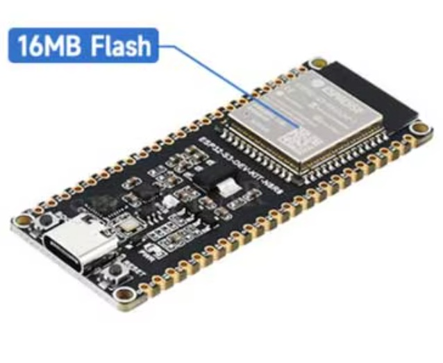
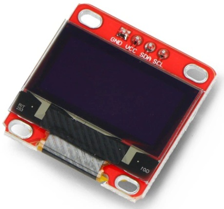
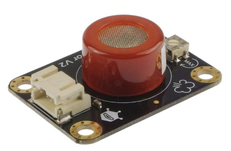
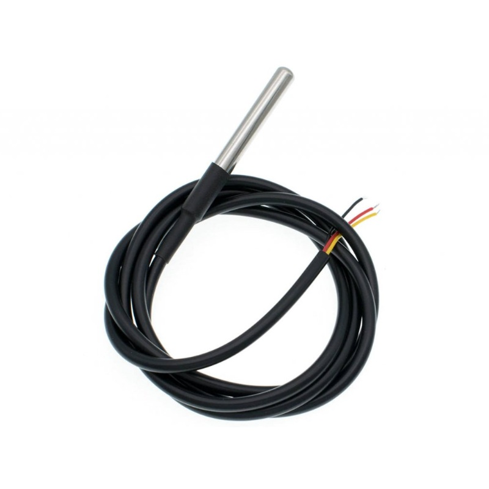
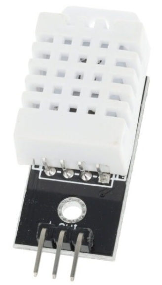
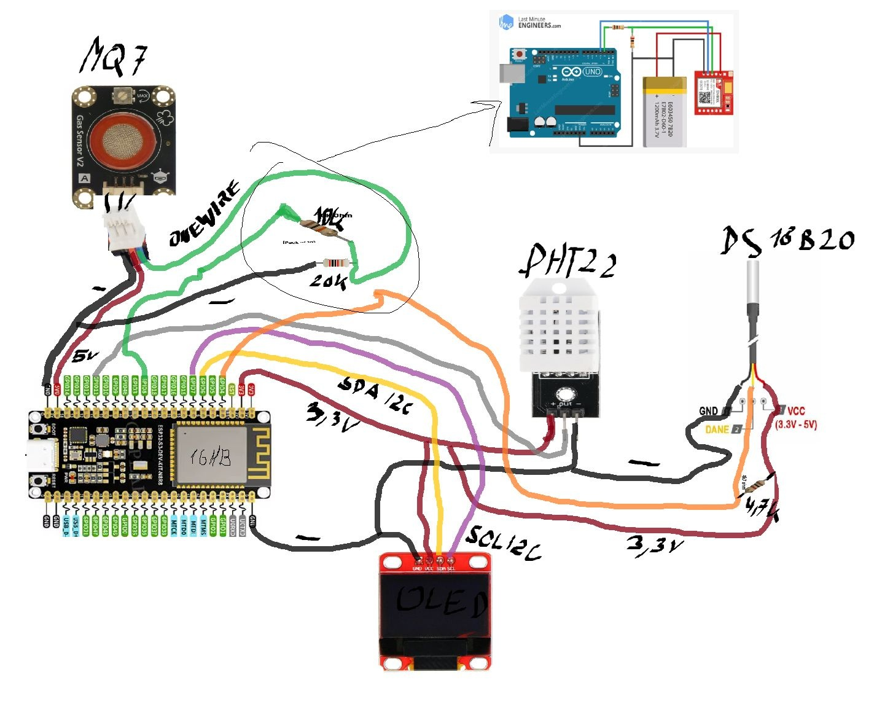

# ELEMENTY SKŁADOWE PROJEKTU
## ESP32-S3-WROOM-1-N8R8 WiFi/Bluetooth 16MB

## Wyświetlacz OLED niebieski graficzny 0,96'' 128x64px I2C

## Gravity: Analog Carbon Monoxide Sensor (MQ7) - moduł z czujnikiem tlenku węgla

## Czujnik temperatury DS18B20 TO92 1-Wire Dallas

## Moduł DHT22 Czujnik Temperatury i Wilgotności Black

# SCHEMAT POŁĄCZEŃ

